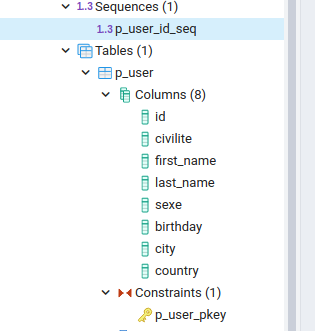
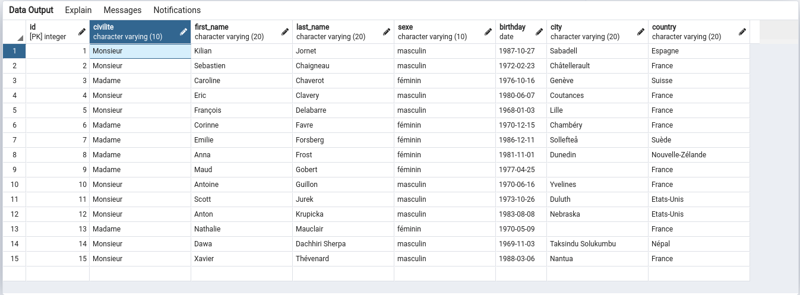

TRAILER PLAN DATABASE WITH POSTGRESQL
=====================================

This this is the database in postgresql for the project TRAILERPLAN in https://github.com/boonsuli/trailerpplan-user.
It use docker compose to launch an container docker with postgresql 12.5 and the client pgadmin 4.30.

First :
```shell script
$ docker pull postgres:12.5-alpine

$ docker pull dpage/pgadmin4:4.30
```

Check the images :
```shell script
$ docker images
REPOSITORY      TAG          IMAGE ID      CREATED  SIZE
postgres        12.5-alpine  ...           ... ago  ...MB
dpage/pgadmin4  4.30         ...           ... ago  ...MB
```

To run an container from the images :
```shell script
$ docker network create --driver bridge pgnetwork

$ docker run --name db-postgres -e 'POSTGRES_PASSWORD=P@ssw0rD' -v /var/lib/postgres/data --hostname='postgres-server' --network='pgnetwork' -p 5432:5432 -d postgres

$ docker run --name db-pgadmin  -e 'PGADMIN_DEFAULT_EMAIL=boonsuli@gmail.com' -e 'PGADMIN_DEFAULT_PASSWORD=P@ssw0rD' --hostname='pgadmin-server' --network='pgnetwork' -p 5050:80 -d dpage/pgadmin4
```

To run the container from docker-compose yml file :
```shell script
$ docker-compose up -d
```

access to http://localhost:5050 and use the credential : admin@trailerplan.com/P@ssw0rD



