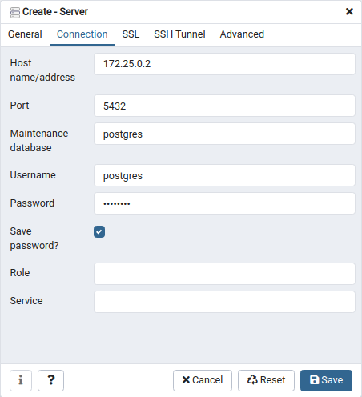
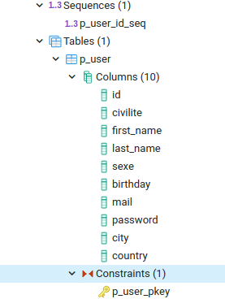

TRAILER PLAN DATABASE WITH POSTGRESQL AND DJANGO
================================================

This is the database in postgresql for the project TRAILERPLAN in https://github.com/boonsuli/trailerpplan-user.
It use docker compose to launch some container docker with postgresql 12.5, the database client pgadmin 4.30 and an application python.
In this application python there is django, django rest, bootstrap and jquery. The features of this application are :

- list the users in the browser from database
- load an user in an popup modal from the database postgres with ajax
- edit an user in the popup
- save the user to database with ajax
- modify the editing user in the list without refresh the page
- api rest for : 
    - GET, list the users
    - GET, get an user
    - PUT, modify an user
 

the list of the users in pgadmin:


the list of the users in the application:


First :
```shell script
$ docker pull postgres:12.5-alpine
$ docker pull dpage/pgadmin4:4.30
$ docker pull python:3.8.6-slim-buster
```

Check the images :
```shell script
$ docker images
REPOSITORY      TAG                IMAGE ID      CREATED  SIZE
postgres        12.5-alpine        e07060185412  ... ago  158MB
dpage/pgadmin4  4.30               7db8147d0c7b  ... ago  278MB
python          3.8.6-slim-buster  0f59d947500d  ... ago  113MB
```


To run the container from the root dir of the project with the docker-compose yml file. The value of the log level is {critical, debug, error, info, warning} :
```shell script
$ docker-compose --env-file ./docker/config/env.file --log-level debug up
```


Access to http://localhost:5050 and use the credential : postgres@trailerplan.com/P@55w*rD


```shell script
$ docker-compose --env-file ./docker/config/env.dev ps
       Name                     Command              State               Ports            
------------------------------------------------------------------------------------------
pgadmin-container    /entrypoint.sh                  Up      443/tcp, 0.0.0.0:5050->80/tcp
postgres-container   docker-entrypoint.sh postgres   Up      0.0.0.0:5432->5432/tcp  
```

```shell script
$ docker network ls
NETWORK ID     NAME                                       DRIVER    SCOPE
7081b67cc9e6   bridge                                     bridge    local
38d3331fa154   host                                       host      local
d6b6eb4d5cef   none                                       null      local
3f49d69013e8   trailerplan-db-django_postgres-network     bridge    local
```

```shell script
$ docker volume ls
DRIVER    VOLUME NAME
local     trailerplan-db-postgres_pg-data
local     trailerplan-db-postgres_pgadmin-data
```

```shell script
$ docker ps
CONTAINER ID   IMAGE                  COMMAND                  CREATED              STATUS              PORTS                           NAMES
a4a14b2c36cf   dpage/pgadmin4:4.30    "/entrypoint.sh"         About a minute ago   Up About a minute   443/tcp, 0.0.0.0:5050->80/tcp   pgadmin-container
e650842d9ac3   postgres:12.5-alpine   "docker-entrypoint.s…"   About a minute ago   Up About a minute   0.0.0.0:5432->5432/tcp          postgres-container
```

```shell script
$ docker inspect postgres-container
...
            "Networks": {
                "trailerplan-db-postgres_postgres-network": {
                    "IPAMConfig": null,
                    "Links": null,
                    "Aliases": [
                        "postgres",
                        "e650842d9ac3",
                        "postgres-server"
                    ],
                    "NetworkID": "de26e3b23340223e5dab1b7b4797f2c6c6e1d984509fac51355767159b87521b",
                    "EndpointID": "c1aafbe9498acf881c380f519ea8a5d75cf84e4cca933baacf357fd4784988c2",
                    "Gateway": "172.25.0.1",
                    "IPAddress": "172.25.0.2",
                    "IPPrefixLen": 16,
                    "IPv6Gateway": "",
                    "GlobalIPv6Address": "",
                    "GlobalIPv6PrefixLen": 0,
                    "MacAddress": "02:42:ac:13:00:02",
                    "DriverOpts": null
...
```
 The ip address of the container postgres-container is __172.25.0.2__.  

To create a database server in pgadmin. Use right click on Servers and create the server.


Then fill the server name to : **postgres-server**


In the connection tab, fill the IP address you are get before from 'docker inspect postgres-container'


We need also the password to access to the database from the environment file. In the config file ```docker/config/env.dev``` 
use the password in the property : **POSTGRES_PASSWORD**

Finally the table of P_USER is created, the schema is applied and the data is populated according to the sql script.


