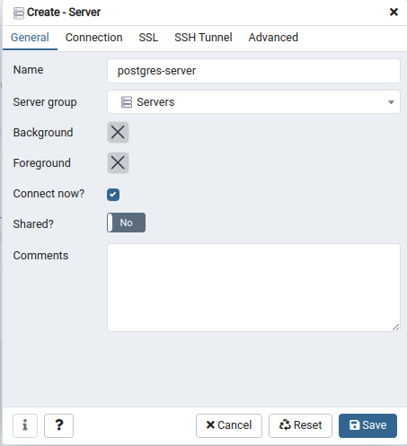

TRAILER PLAN DATABASE WITH POSTGRESQL
=====================================

This this is the database in postgresql for the project TRAILERPLAN in https://github.com/boonsuli/trailerpplan-user.
It use docker compose to launch an container docker with postgresql 12.5 and the client pgadmin 4.30.

First :
```shell script
$ docker pull postgres:12.5-alpine

$ docker pull dpage/pgadmin4:4.30
```

Check the images :
```shell script
$ docker images
REPOSITORY      TAG          IMAGE ID      CREATED  SIZE
postgres        12.5-alpine  e07060185412  ... ago  158MB
dpage/pgadmin4  4.30         7db8147d0c7b  ... ago  278MB
```

To run an container from the images :
```shell script
$ docker network create --driver bridge pgnetwork

$ docker run --name db-postgres -e 'POSTGRES_PASSWORD=P@ssw0rD' -v /var/lib/postgres/data --hostname='postgres-server' --network='pgnetwork' -p 5432:5432 -d postgres

$ docker run --name db-pgadmin  -e 'PGADMIN_DEFAULT_EMAIL=boonsuli@gmail.com' -e 'PGADMIN_DEFAULT_PASSWORD=P@ssw0rD' --hostname='pgadmin-server' --network='pgnetwork' -p 5050:80 -d dpage/pgadmin4
```

To run the container from the root dir of the project with the docker-compose yml file :
```shell script
$ docker-compose --env-file ./config/env.file up
```

Access to http://localhost:5050 and use the credential : admin@trailerplan.com/P@ssw0rD


```shell script
$ docker-compose --env-file ./config/env.dev ps
       Name                     Command              State               Ports            
------------------------------------------------------------------------------------------
pgadmin-container    /entrypoint.sh                  Up      443/tcp, 0.0.0.0:5050->80/tcp
postgres-container   docker-entrypoint.sh postgres   Up      0.0.0.0:5432->5432/tcp  
```

```shell script
$ docker network ls
NETWORK ID     NAME                                       DRIVER    SCOPE
7081b67cc9e6   bridge                                     bridge    local
38d3331fa154   host                                       host      local
d6b6eb4d5cef   none                                       null      local
3f49d69013e8   trailerplan-db-postgres_postgres-network   bridge    local
```

```shell script
$ docker volume ls
DRIVER    VOLUME NAME
local     trailerplan-db-postgres_pg-data
local     trailerplan-db-postgres_pgadmin-data
```

```shell script
$ docker ps
CONTAINER ID   IMAGE                  COMMAND                  CREATED              STATUS              PORTS                           NAMES
a4a14b2c36cf   dpage/pgadmin4:4.30    "/entrypoint.sh"         About a minute ago   Up About a minute   443/tcp, 0.0.0.0:5050->80/tcp   pgadmin-container
e650842d9ac3   postgres:12.5-alpine   "docker-entrypoint.s…"   About a minute ago   Up About a minute   0.0.0.0:5432->5432/tcp          postgres-container
```

```shell script
$ docker inspect postgres-container
...
            "Networks": {
                "trailerplan-db-postgres_postgres-network": {
                    "IPAMConfig": null,
                    "Links": null,
                    "Aliases": [
                        "postgres",
                        "e650842d9ac3",
                        "postgres-server"
                    ],
                    "NetworkID": "de26e3b23340223e5dab1b7b4797f2c6c6e1d984509fac51355767159b87521b",
                    "EndpointID": "c1aafbe9498acf881c380f519ea8a5d75cf84e4cca933baacf357fd4784988c2",
                    "Gateway": "172.20.0.1",
                    "IPAddress": "172.20.0.2",
                    "IPPrefixLen": 16,
                    "IPv6Gateway": "",
                    "GlobalIPv6Address": "",
                    "GlobalIPv6PrefixLen": 0,
                    "MacAddress": "02:42:ac:13:00:02",
                    "DriverOpts": null
...
```
 The ip address of the container postgres-container is __172.20.0.2__.  

To create a database server in pgadmin. Use right click on Servers and create the server.


Then fill the server name to : **trailerplan-server**



In the connection tab, fill the IP address you are get before from 'docker inspect postgres-container'


We need also the password to access to the database from the environment file.

Finally the table of P_USER is created, the schema is applied and the data is populated according to the sql script.


